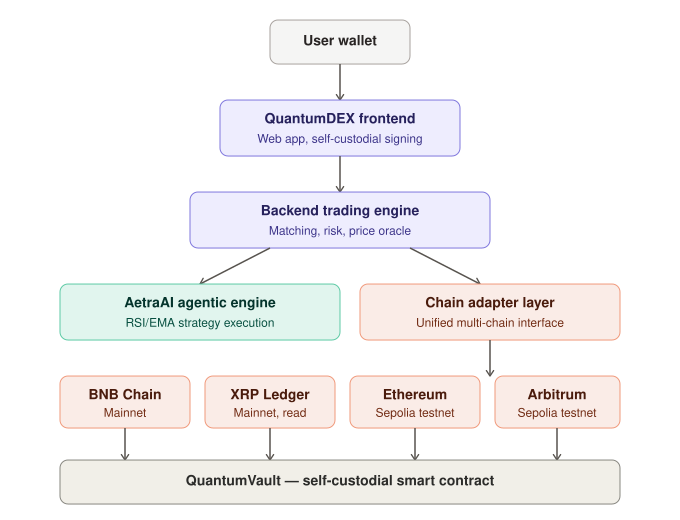

# Architecture

High-level system architecture of QuantumDEX. This diagram intentionally omits internal implementation details (matching algorithm, risk engine logic, AI model internals) in line with our [Security Policy](../../SECURITY.md).

## Layers

1. **User wallet** — trades and fund movements are always signed by the user's own wallet (MetaMask, Rabby). QuantumDEX never takes custody of trading collateral.
2. **QuantumDEX frontend** — the web application at [dex.quantumpaychain.org](https://dex.quantumpaychain.org).
3. **Backend trading engine** — Go-based microservices handling order matching, risk management, and price oracles.
4. **AetraAI agentic engine** — evaluates technical indicators and executes trades automatically within trader-defined limits. Every execution is logged for auditability.
5. **Chain adapter layer** — a single interface (see [`docs/chain-adapter`](../chain-adapter)) that every supported blockchain implements, keeping the core engine chain-agnostic.
6. **QuantumVault** — the self-custodial smart contract deployed identically across all supported EVM chains. See [`docs/smart-contracts`](../smart-contracts) for verified addresses.
